# nf-core/chipseq: Output

## Introduction

This document describes the output produced by the pipeline. Most of the plots are taken from the MultiQC report generated from the [full-sized test dataset](https://github.com/nf-core/test-datasets/tree/chipseq#full-test-dataset-origin) for the pipeline using a command similar to the one below:

```console
nextflow run nf-core/chipseq -profile test_full,<docker/singularity/institute>
```

The directories listed below will be created in the output directory after the pipeline has finished. All paths are relative to the top-level results directory.

## Pipeline overview

The pipeline is built using [Nextflow](https://www.nextflow.io/). See [`main README.md`](../README.md) for a condensed overview of the steps in the pipeline, and the bioinformatics tools used at each step.

See [Illumina website](https://emea.illumina.com/techniques/sequencing/dna-sequencing/chip-seq.html) for more information regarding the ChIP-seq protocol, and for an extensive list of publications.

## Library-level analysis

The initial QC and alignments are performed at the library-level e.g. if the same library has been sequenced more than once to increase sequencing depth. This has the advantage of being able to assess each library individually, and the ability to process multiple libraries from the same sample in parallel.

### Raw read QC

<details markdown="1">
    <summary>Output files</summary>

- `fastqc/`
  - `*_fastqc.html`: FastQC report containing quality metrics for read 1 (_and read2 if paired-end_) **before** adapter trimming.
- `fastqc/zips/`
  - `*_fastqc.zip`: Zip archive containing the FastQC report, tab-delimited data file and plot images.

</details>

[FastQC](http://www.bioinformatics.babraham.ac.uk/projects/fastqc/) gives general quality metrics about your sequenced reads. It provides information about the quality score distribution across your reads, per base sequence content (%A/T/G/C), adapter contamination and overrepresented sequences. For further reading and documentation see the [FastQC help pages](http://www.bioinformatics.babraham.ac.uk/projects/fastqc/Help/).

### Adapter trimming

<details markdown="1">
    <summary>Output files</summary>

- `trimgalore/`
  - `*fastq.gz`: If `--save_trimmed` is specified, FastQ files **after** adapter trimming will be placed in this directory.
- `trimgalore/logs/`
  - `*.log`: Log file generated by Trim Galore!.
- `trimgalore/fastqc/`
  - `*_fastqc.html`: FastQC report containing quality metrics for read 1 (_and read2 if paired-end_) **after** adapter trimming.
- `trimgalore/fastqc/zips/`
  - `*_fastqc.zip`: Zip archive containing the FastQC report, tab-delimited data file and plot images.

</details>

[Trim Galore!](https://www.bioinformatics.babraham.ac.uk/projects/trim_galore/) is a wrapper tool around Cutadapt and FastQC to consistently apply quality and adapter trimming to FastQ files. By default, Trim Galore! will automatically detect and trim the appropriate adapter sequence. See [`usage.md`](usage.md) for more details about the trimming options.

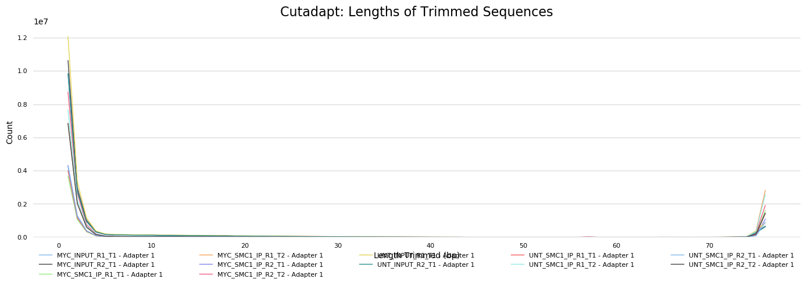

### Alignment

The pipeline has been written in a way where all the files generated downstream of the alignment are placed in the same directory as specified by `--aligner` e.g. if `--aligner bwa` is specified then all the downstream results will be placed in the `bwa/` directory. This helps with organising the directory structure and more importantly, allows the end-user to get the results from multiple aligners by simply re-running the pipeline with a different `--aligner` option along the `-resume` parameter. It also means that results won't be overwritten when resuming the pipeline and can be used for benchmarking between alignment algorithms if required. Thus, `<ALIGNER>` in the directory structure below corresponds to the aligner set when running the pipeline.

<details markdown="1">
    <summary>Output files</summary>

- `<ALIGNER>/library/`
  - `*.bam`: The files resulting from the alignment of individual libraries are not saved by default so this directory will not be present in your results. You can override this behaviour with the use of the `--save_align_intermeds` flag in which case it will contain the coordinate sorted alignment files in [`*.bam`](https://samtools.github.io/hts-specs/SAMv1.pdf) format.
- `<ALIGNER>/library/samtools_stats/`
  - SAMtools `<SAMPLE>.sorted.bam.flagstat`, `<SAMPLE>.sorted.bam.idxstats` and `<SAMPLE>.sorted.bam.stats` files generated from the alignment files.

> **NB:** File names in the resulting directory (i.e. `<ALIGNER>/library/`) will have the '`.Lb.`' suffix.

</details>

Adapter-trimmed reads are mapped to the reference assembly using the aligner set by the `--aligner` parameter. Available aligners are [BWA](http://bio-bwa.sourceforge.net/bwa.shtml) (default), [Bowtie 2](http://bowtie-bio.sourceforge.net/bowtie2/index.shtml), [Chromap](https://github.com/haowenz/chromap) and [STAR](https://github.com/alexdobin/STAR). A genome index is required to run any of this aligners so if this is not provided explicitly using the corresponding parameter (e.g. `--bwa_index`), then it will be created automatically from the genome fasta input. The index creation process can take a while for larger genomes so it is possible to use the `--save_reference` parameter to save the indices for future pipeline runs, reducing processing times.

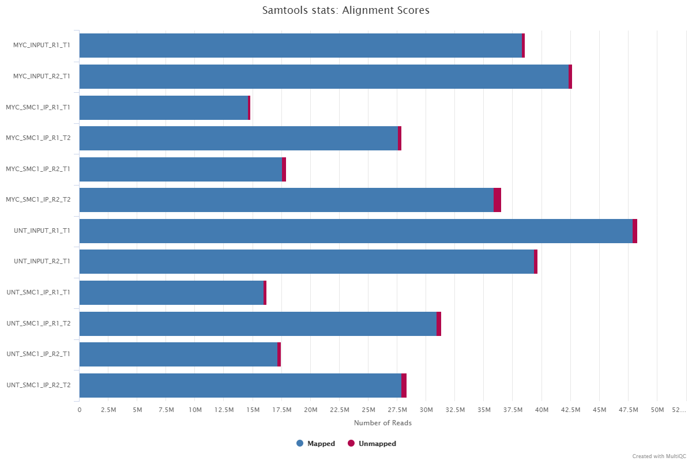

> **NB:** Currently, paired-end files produced by `Chromap` are excluded from downstream analysis due to [this](https://github.com/nf-core/chipseq/issues/291) issue. Single-end files are processed normally.

#### Unmapped reads

The `--save_unaligned` parameter enables to obtain FastQ files containing unmapped reads (only available for STAR and Bowtie2).

<details markdown="1">
    <summary>Output files</summary>
- `<ALIGNER>/library/unmapped/`
  - `*.fastq.gz`: If `--save_unaligned` is specified, FastQ files containing unmapped reads will be placed in this directory.

</details>

#### STAR logs

<details markdown="1">
    <summary>Output files</summary>

- `star/library/log/`
  - `*.SJ.out.tab`: File containing filtered splice junctions detected after mapping the reads.
  - `*.Log.final.out`: STAR alignment report containing the mapping results summary.
  - `*.Log.out` and `*.Log.progress.out`: STAR log files containing detailed information about the run. Typically only useful for debugging purposes.

</details>

## Merged library-level analysis

The library-level alignments associated with the same sample are merged and subsequently used for the downstream analyses.

### Alignment merging, duplicate marking, filtering and QC

<details markdown="1">
    <summary>Output files</summary>

- `<ALIGNER>/mergedLibrary/`
  - `*.bam`: Merged library-level, coordinate sorted `*.bam` files after the marking of duplicates, and filtering based on various criteria. The file suffix for the final filtered files will be `*.mLb.clN.*`. If you specify the `--save_align_intermeds` parameter then two additional sets of files will be present. These represent the unfiltered alignments with duplicates marked (`*.mLb.mkD.*`), and in the case of paired-end datasets the filtered alignments before the removal of orphan read pairs (`*.mLb.flT.*`).
- `<ALIGNER>/mergedLibrary/samtools_stats/`
  - SAMtools `*.flagstat`, `*.idxstats` and `*.stats` files generated from the alignment files.
- `<ALIGNER>/mergedLibrary/picard_metrics/`
  - `*_metrics`: Alignment QC files from picard CollectMultipleMetrics.
  - `*.metrics.txt`: Metrics file from MarkDuplicates.
- `<ALIGNER>/mergedLibrary/picard_metrics/pdf/`
  - `*.pdf`: Alignment QC plot files from picard CollectMultipleMetrics.
- `<ALIGNER>/mergedLibrary/preseq/`
  - `*.lc_extrap.txt`: Preseq expected future yield file.

> **NB:** File names in the resulting directory (i.e. `<ALIGNER>/mergedLibrary/`) will have the '`.mLb.`' suffix.

</details>

[Picard MergeSamFiles and MarkDuplicates](https://broadinstitute.github.io/picard/command-line-overview.html) are used in combination to merge the alignments, and for the marking of duplicates, respectively. If you only have one library for any given replicate then the merging step is not carried out because the library-level and merged library-level BAM files will be exactly the same.

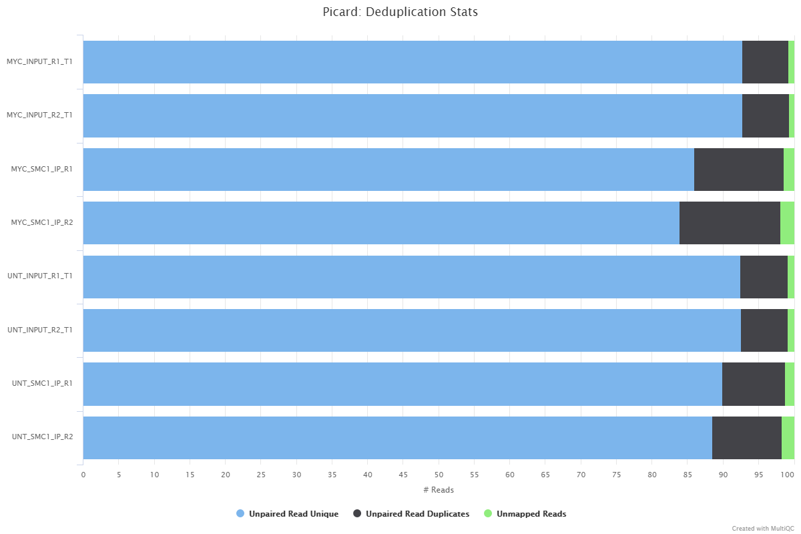

Read duplicate marking is carried out using the Picard MarkDuplicates command. Duplicate reads are generally removed from the aligned reads to mitigate for fragments in the library that may have been sequenced more than once due to PCR biases. There is an option to keep duplicate reads with the `--keep_dups` parameter but its generally recommended to remove them to avoid the wrong interpretation of the results. A similar option has been provided to keep reads that are multi-mapped - `--keep_multi_map`. Other steps have been incorporated into the pipeline to filter the resulting alignments - see [`main README.md`](../README.md) for a more comprehensive listing, and the tools used at each step. A selection of alignment-based QC metrics generated by Picard CollectMultipleMetrics and MarkDuplicates will be included in the MultiQC report.

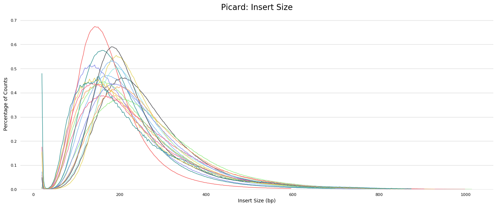

The [Preseq](http://smithlabresearch.org/software/preseq/) package is aimed at predicting and estimating the complexity of a genomic sequencing library, equivalent to predicting and estimating the number of redundant reads from a given sequencing depth and how many will be expected from additional sequencing using an initial sequencing experiment. The estimates can then be used to examine the utility of further sequencing, optimize the sequencing depth, or to screen multiple libraries to avoid low complexity samples. The dashed line shows a perfectly complex library where total reads = unique reads. Note that these are predictive numbers only, not absolute. The MultiQC plot can sometimes give extreme sequencing depth on the X axis - click and drag from the left side of the plot to zoom in on more realistic numbers.

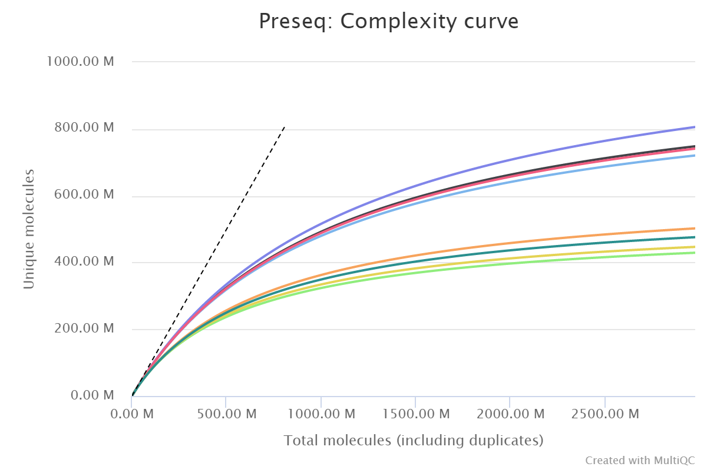

### Normalised bigWig files

<details markdown="1">
    <summary>Output files</summary>

- `<ALIGNER>/mergedLibrary/bigwig/`
  - `*.bigWig`: Normalised bigWig files scaled to 1 million mapped reads.

</details>

The [bigWig](https://genome.ucsc.edu/goldenpath/help/bigWig.html) format is in an indexed binary format useful for displaying dense, continuous data in Genome Browsers such as the [UCSC](https://genome.ucsc.edu/cgi-bin/hgTracks) and [IGV](http://software.broadinstitute.org/software/igv/). This mitigates the need to load the much larger BAM files for data visualisation purposes which will be slower and result in memory issues. The coverage values represented in the bigWig file can also be normalised in order to be able to compare the coverage across multiple samples - this is not possible with BAM files. The bigWig format is also supported by various bioinformatics software for downstream processing such as meta-profile plotting.

### ChIP-seq QC metrics

<details markdown="1">
    <summary>Output files</summary>

- `<ALIGNER>/mergedLibrary/phantompeakqualtools/`
  - `*.spp.out`, `*.spp.pdf`: phantompeakqualtools output files.
  - `*_mqc.tsv`: MultiQC custom content files.
- `<ALIGNER>/mergedLibrary/deepTools/plotFingerprint/`
  - `*.plotFingerprint.pdf`, `*.plotFingerprint.qcmetrics.txt`, `*.plotFingerprint.raw.txt`: plotFingerprint output files.
- `<ALIGNER>/mergedLibrary/deepTools/plotProfile/`
  - `*.computeMatrix.mat.gz`, `*.computeMatrix.vals.mat.tab`, `*.plotProfile.pdf`, `*.plotProfile.tab`, `*.plotHeatmap.pdf`, `*.plotHeatmap.mat.tab`: plotProfile output files.

</details>

[phantompeakqualtools](https://github.com/kundajelab/phantompeakqualtools) plots the strand cross-correlation of aligned reads for each sample. In a strand cross-correlation plot, reads are shifted in the direction of the strand they map to by an increasing number of base pairs and the Pearson correlation between the per-position read count for each strand is calculated. Two cross-correlation peaks are usually observed in a ChIP experiment, one corresponding to the read length ("phantom" peak) and one to the average fragment length of the library. The absolute and relative height of the two peaks are useful determinants of the success of a ChIP-seq experiment. A high-quality IP is characterized by a ChIP peak that is much higher than the "phantom" peak, while often very small or no such peak is seen in failed experiments.

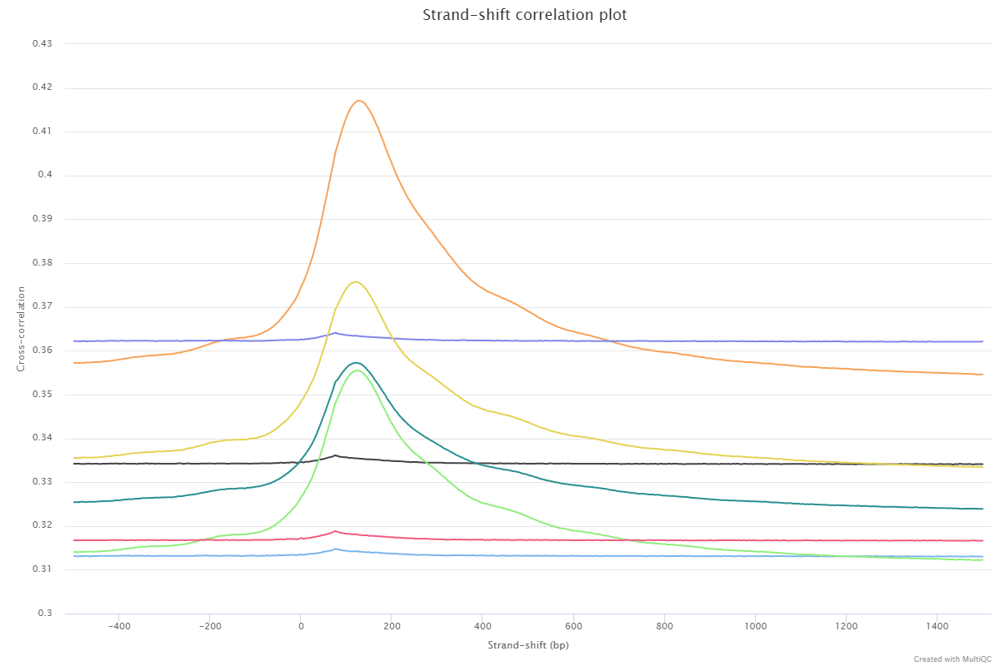

Normalized strand coefficient (NSC) is the normalized ratio between the fragment-length cross-correlation peak and the background cross-correlation. NSC values range from a minimum of 1 to larger positive numbers. 1.1 is the critical threshold. Datasets with NSC values much less than 1.1 (< 1.05) tend to have low signal to noise or few peaks (this could be biological e.g. a factor that truly binds only a few sites in a particular tissue type OR it could be due to poor quality). ENCODE cut-off: **NSC > 1.05**.

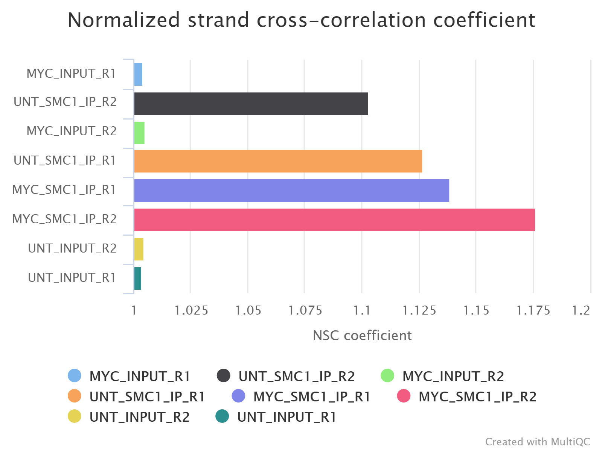

Relative strand correlation (RSC) is the ratio between the fragment-length peak and the read-length peak. RSC values range from 0 to larger positive values. 1 is the critical threshold. RSC values significantly lower than 1 (< 0.8) tend to have low signal to noise. The low scores can be due to failed and poor quality ChIP, low read sequence quality and hence lots of mis-mappings, shallow sequencing depth (significantly below saturation) or a combination of these. Like the NSC, datasets with few binding sites (< 200), which is biologically justifiable, also show low RSC scores. ENCODE cut-off: **RSC > 0.8**.

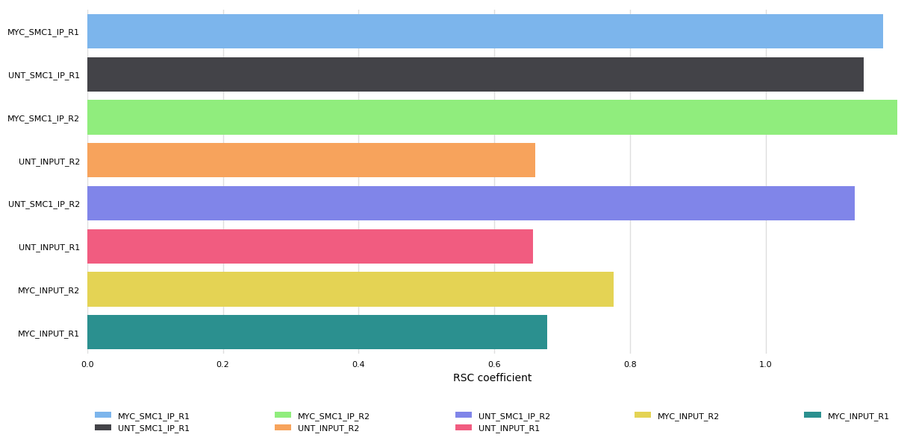

[deepTools](https://deeptools.readthedocs.io/en/develop/content/list_of_tools.html) plotFingerprint is a useful QC for ChIP-seq data in order to see the relative enrichment of the IP samples with respect to the controls on a genome-wide basis. The results, however, are expected to look different for example when comparing narrow marks such as transcription factors and broader marks such as histone modifications (see [plotFingerprint docs](https://deeptools.readthedocs.io/en/develop/content/tools/plotFingerprint.html)).

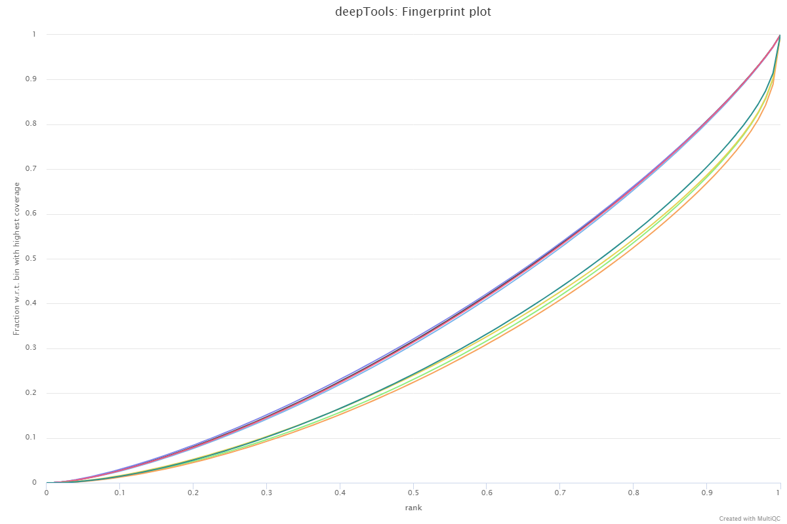

The results from deepTools plotProfile gives you a quick visualisation for the genome-wide enrichment of your samples at the TSS, and across the gene body. During the downstream analysis, you may want to refine the features/genes used to generate these plots in order to see a more specific condition-related effect.

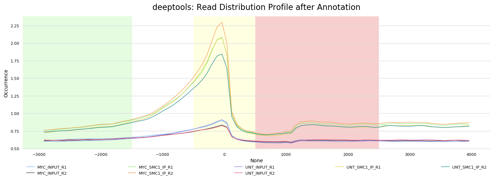

### Call peaks

<details markdown="1">
    <summary>Output files</summary>

- `<ALIGNER>/mergedLibrary/macs2/<PEAK_TYPE>/`
  - `*.xls`, `*.broadPeak` or `*.narrowPeak`, `*.gappedPeak`, `*summits.bed`: MACS2 output files - the files generated will depend on whether MACS2 has been run in _narrowPeak_ or _broadPeak_ mode.
  - `*.annotatePeaks.txt`: HOMER peak-to-gene annotation file.
- `<ALIGNER>/mergedLibrary/macs2/<PEAK_TYPE>/qc/`
  - `macs2_peak.plots.pdf`: QC plots for MACS2 peaks.
  - `macs2_annotatePeaks.plots.pdf`: QC plots for peak-to-gene feature annotation.
  - `*.FRiP_mqc.tsv`, `*.peak_count_mqc.tsv`, `annotatepeaks.summary_mqc.tsv`: MultiQC custom-content files for FRiP score, peak count and peak-to-gene ratios.

> **NB:** `<PEAK_TYPE>` in the directory structure above corresponds to the type of peak that you have specified to call with MACS2 i.e. `broadPeak` or `narrowPeak`. If you so wish, you can call both narrow and broad peaks without redoing the preceding steps in the pipeline such as the alignment and filtering. For example, if you already have broad peaks then just add `--narrow_peak -resume` to the command you used to run the pipeline, and these will be called too! However, resuming the pipeline will only be possible if you have not deleted the `work/` directory generated by the pipeline.

</details>

[MACS2](https://github.com/macs3-project/MACS) is one of the most popular peak-calling algorithms for ChIP-seq data. By default, the peaks are called with the MACS2 `--broad` parameter. If, however, you would like to call narrow peaks then please provide the `--narrow_peak` parameter when running the pipeline. See [MACS2 outputs](https://github.com/macs3-project/MACS/blob/master/docs/callpeak.md#output-files) for a description of the output files generated by MACS2.

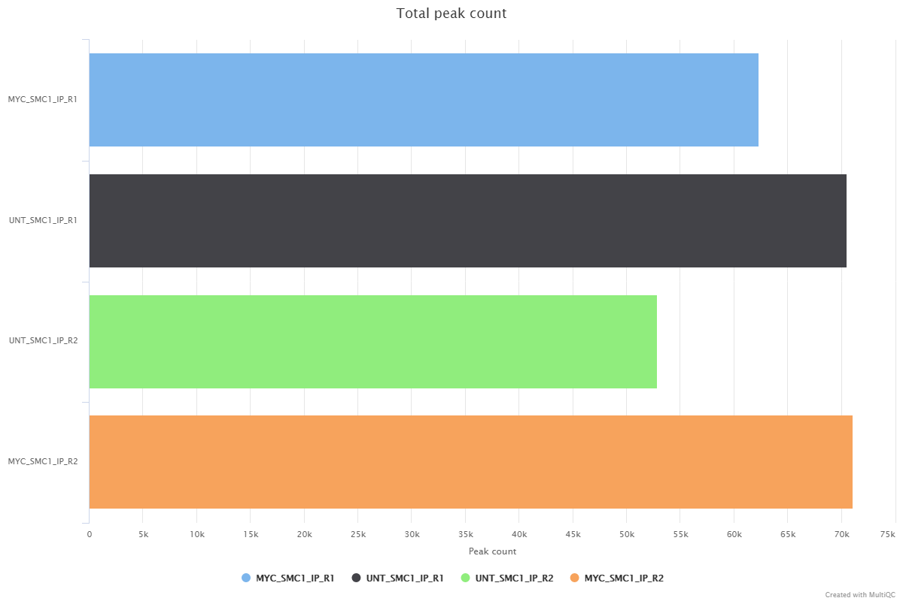

[HOMER annotatePeaks.pl](http://homer.ucsd.edu/homer/ngs/annotation.html) is used to annotate the peaks relative to known genomic features. HOMER is able to use the `--gtf` annotation file which is provided to the pipeline. Please note that some of the output columns will be blank because the annotation is not provided using HOMER's in-built database format. However, the more important fields required for downstream analysis will be populated i.e. _Annotation_, _Distance to TSS_ and _Nearest Promoter ID_.


Various QC plots per sample including number of peaks, fold-change distribution, [FRiP score](https://genome.cshlp.org/content/22/9/1813.full.pdf+html) and peak-to-gene feature annotation are also generated by the pipeline. Where possible these have been integrated into the MultiQC report.

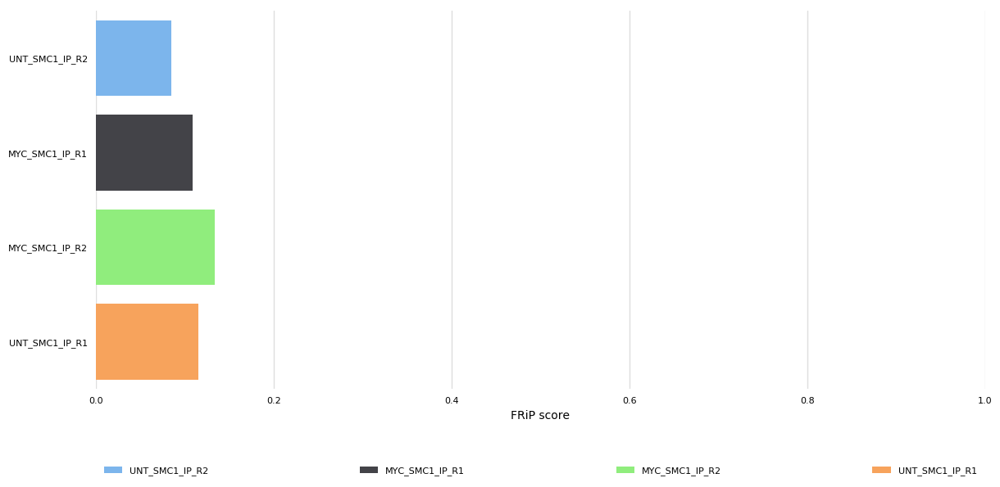

### Create and quantify consensus set of peaks

<details markdown="1">
    <summary>Output files</summary>

- `<ALIGNER>/mergedLibrary/macs2/<PEAK_TYPE>/consensus/<ANTIBODY>/`
  - `*.bed`: Consensus peak-set across all samples in BED format.
  - `*.saf`: Consensus peak-set across all samples in SAF format. Required by featureCounts for read quantification.
  - `*.featureCounts.txt`: Read counts across all samples relative to consensus peak-set.
  - `*.annotatePeaks.txt`: HOMER peak-to-gene annotation file for consensus peaks.
  - `*.boolean.annotatePeaks.txt`: Spreadsheet representation of consensus peak-set across samples **with** gene annotation columns. The columns from individual peak files are included in this file along with the ability to filter peaks based on their presence or absence in multiple replicates/conditions.
  - `*.boolean.txt`: Spreadsheet representation of consensus peak-set across samples **without** gene annotation columns. Same as file above but without annotation columns.
  - `*.boolean.intersect.plot.pdf`, `*.boolean.intersect.txt`: [UpSetR](https://cran.r-project.org/web/packages/UpSetR/README.html) files to illustrate peak intersection.

</details>

In order to perform the differential binding analysis we need to be able to carry out the read quantification for the same intervals across **all** of the samples in the experiment. To this end, the individual peak-sets called per sample have to be merged together in order to create a consensus set of peaks.

Using the consensus peaks it is possible to assess the degree of overlap between the peaks from a set of samples e.g. _Which consensus peaks contain peaks that are common/unique to a given set of samples?_. This may be useful for downstream filtering of peaks based on whether they are called in multiple replicates/conditions. Please note that it is possible for a consensus peak to contain multiple peaks from the same sample. Unfortunately, this is sample-dependent but the files generated by the pipeline do have columns that report such instances and allow you to factor them into any further analysis.

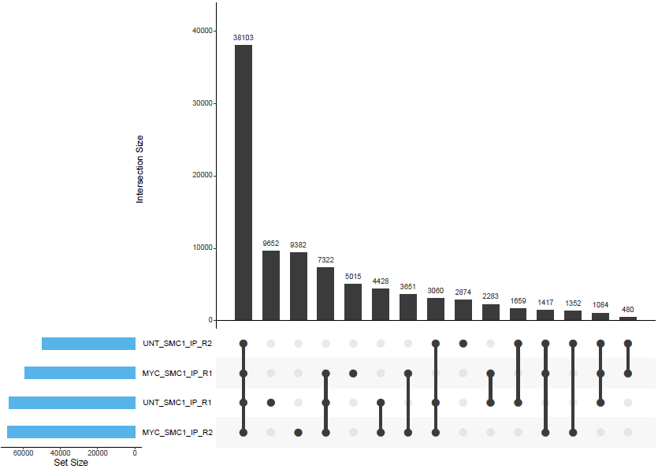

By default, the peak-sets are not filtered, therefore, the consensus peaks will be generated across the union set of peaks from all samples. However, you can increment the `--min_reps_consensus` parameter appropriately if you are confident you have good reproducibility amongst your replicates to create a "reproducible" set of consensus of peaks. In future iterations of the pipeline more formal analyses such as [IDR](https://projecteuclid.org/euclid.aoas/1318514284) may be implemented to obtain reproducible and high confidence peak-sets with which to perform this sort of analysis.

The [featureCounts](http://bioinf.wehi.edu.au/featureCounts/) tool is used to count the number of reads relative to the consensus peak-set across all of the samples. This essentially generates a file containing a matrix where the rows represent the consensus intervals, the columns represent all of the samples in the experiment, and the values represent the raw read counts.

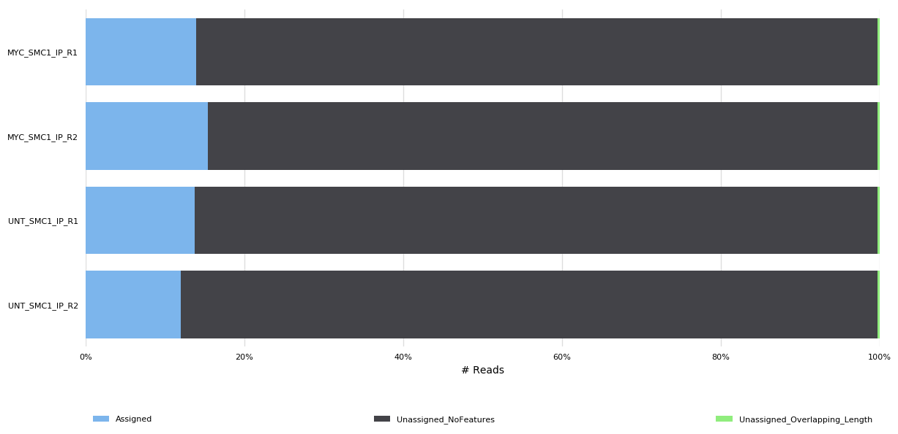

### Read counting and differential binding analysis

<details markdown="1">
    <summary>Output files</summary>

- `<ALIGNER>/mergedLibrary/macs2/<PEAK_TYPE>/consensus/<ANTIBODY>/deseq2/`
  - `*.sample.dists.txt`: Spreadsheet containing sample-to-sample distance across each consensus peak.
  - `*.plots.pdf`: File containing PCA and hierarchical clustering plots.
  - `*.dds.RData`: File containing R `DESeqDataSet` object generated by DESeq2, with either
    an rlog or vst `assay` storing the variance-stabilised data.
  - `*.rds`: Alternative version of the RData file suitable for
    `readRDS` to give user control of the eventual object name.
  - `*pca.vals.txt`: Matrix of values for the first 2 principal components.
  - `R_sessionInfo.log`: File containing information about R, the OS and attached or loaded packages.
  - `<ALIGNER>/mergedLibrary/macs2/<PEAK_TYPE>/consensus/<ANTIBODY>/sizeFactors/`
  - `*.txt`, `*.RData`: Files containing DESeq2 sizeFactors per sample.

</details>

[DESeq2](https://bioconductor.org/packages/release/bioc/vignettes/DESeq2/inst/doc/DESeq2.html) is more commonly used to perform differential expression analysis for RNA-seq datasets. However, it can also be used for ChIP-seq differential binding analysis, in which case you can imagine that instead of counts per gene for RNA-seq data we now have counts per bound region.

**This pipeline uses a standardised DESeq2 analysis script to get an idea of the reproducibility within the experiment, and to assess the overall differential binding. Please note that this will not suit every experimental design, and if there are other problems with the experiment then it may not work as well as expected.**

For larger experiments, it is recommended to use the `vst` transformation instead of the `rlog` option. This is the default behaviour and can be controlled with the `--deseq2_vst` parameter. See [DESeq2 docs](http://bioconductor.org/packages/devel/bioc/vignettes/DESeq2/inst/doc/DESeq2.html#data-transformations-and-visualization) for a more detailed explanation.

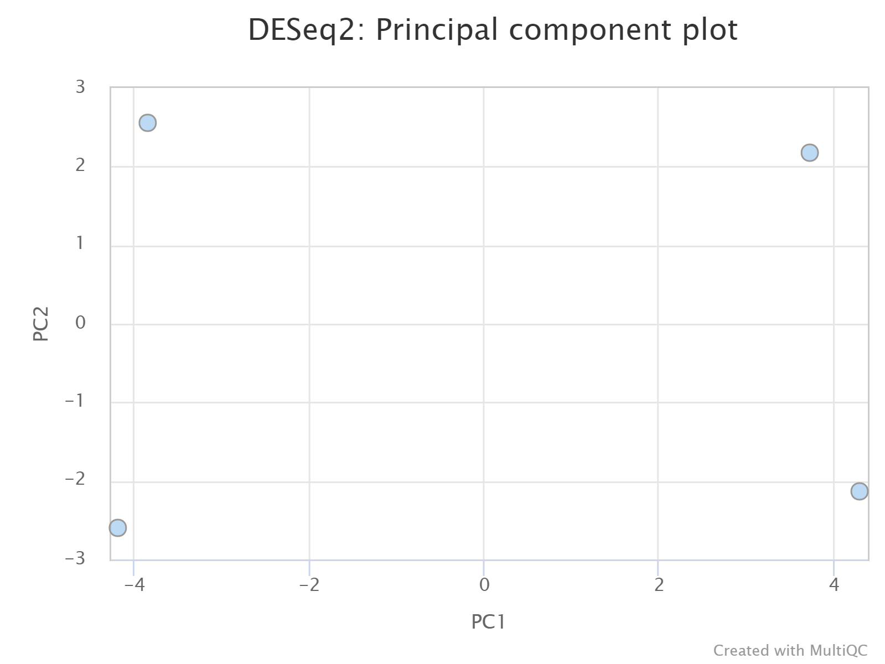

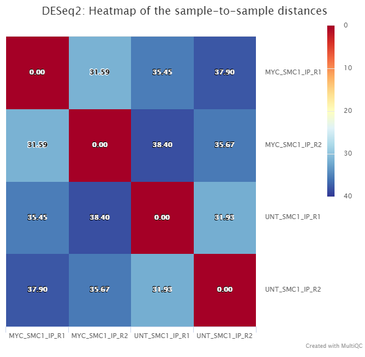

## Aggregate analysis

### Present QC for the raw read, alignment, peak and differential binding results

<details markdown="1">
    <summary>Output files</summary>

- `multiqc/<PEAK_TYPE>/`
  - `multiqc_report.html`: A standalone HTML file that can be viewed in your web browser.
  - `multiqc_data/`: Directory containing parsed statistics from the different tools used in the pipeline.
  - `multiqc_plots/`: Directory containing static images from the report in various formats.

</details>

[MultiQC](https://multiqc.info/docs/) is a visualisation tool that generates a single HTML report summarising all samples in your project. Most of the pipeline QC results are visualised in the report and further statistics are available within the report data directory.

Results generated by MultiQC collate pipeline QC from FastQC, TrimGalore, samtools flagstat, samtools idxstats, samtools stats, picard CollectMultipleMetrics, picard MarkDuplicates, Preseq, deepTools plotProfile, deepTools plotFingerprint, phantompeakqualtools and featureCounts. The default [`multiqc config file`](../assets/multiqc_config.yaml) also contains the provision for loading custom-content to report peak counts, FRiP scores, peak-to-gene annnotation proportions, spp NSC coefficient, spp RSC coefficient, PCA plots and sample-similarity heatmaps.

The pipeline has special steps which also allow the software versions to be reported in the MultiQC output for future traceability. For more information about how to use MultiQC reports, see <http://multiqc.info>.

### Create IGV session file

<details markdown="1">
    <summary>Output files</summary>

- `igv/<PEAK_TYPE>/`
  - `igv_session.xml`: Session file that can be directly loaded into IGV.
  - `igv_files.txt`: File containing a listing of the files used to create the IGV session.

</details>

An [IGV](https://software.broadinstitute.org/software/igv/UserGuide) session file will be created at the end of the pipeline containing the normalised bigWig tracks, per-sample peaks, consensus peaks and differential sites. This avoids having to load all of the data individually into IGV for visualisation.

The genome fasta file required for the IGV session will be the same as the one that was provided to the pipeline. This will be copied into `genome/` to overcome any loading issues. If you prefer to use another path or an in-built genome provided by IGV just change the `genome` entry in the second-line of the session file.

The file paths in the IGV session file will only work if the results are kept in the same place on your storage. If the results are moved or for example, if you prefer to load the data over the web then just replace the file paths with others that are more appropriate.

Once installed, open IGV, go to `File > Open Session` and select the `igv_session.xml` file for loading.

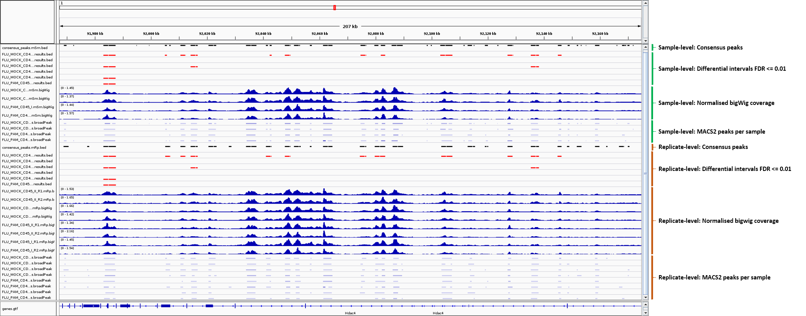

> **NB:** If you are not using an in-built genome provided by IGV you will need to load the annotation yourself e.g. in .gtf and/or .bed format.

## Other results

### Reference genome files

<details markdown="1">
    <summary>Output files</summary>

- `genome/`
  - A number of genome-specific files are generated by the pipeline in order to aid in the filtering of the data, and because they are required by standard tools such as BEDTools. These can be found in this directory along with the genome fasta file which is required by IGV. If using a genome from AWS iGenomes and if it exists a `README.txt` file containing information about the annotation version will also be saved in this directory.
- `genome/index/`

  - `bwa/`: Directory containing BWA indices.
  - `bowtie2/`: Directory containing BOWTIE2 indices.
  - `chromap/`: Directory containing Chromap indices.
  - `star/`: Directory containing STAR indices.

  - If the `--save_reference` parameter is provided then the alignment indices generated by the pipeline will be saved in this directory. This can be quite a time-consuming process so it permits their reuse for future runs of the pipeline or for other purposes.

</details>

Reference genome-specific files can be useful to keep for the downstream processing of the results.

### Pipeline information

<details markdown="1">
    <summary>Output files</summary>

- `pipeline_info/`
  - Reports generated by Nextflow: `execution_report.html`, `execution_timeline.html`, `execution_trace.txt` and `pipeline_dag.dot`/`pipeline_dag.svg`.
  - Reports generated by the pipeline: `pipeline_report.html`, `pipeline_report.txt` and `software_versions.yml`. The `pipeline_report*` files will only be present if the `--email` / `--email_on_fail` parameter's are used when running the pipeline.
  - Reformatted samplesheet files used as input to the pipeline: `samplesheet.valid.csv`.

</details>

[Nextflow](https://www.nextflow.io/docs/latest/tracing.html) provides excellent functionality for generating various reports relevant to the running and execution of the pipeline. This will allow you to trouble-shoot errors with the running of the pipeline, and also provide you with other information such as launch commands, run times and resource usage.
