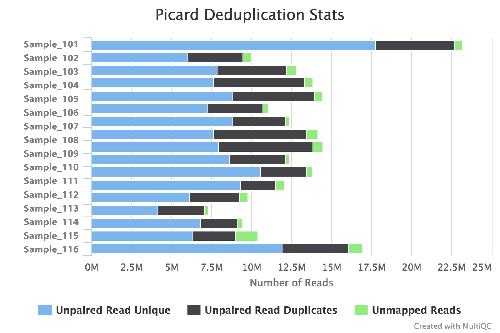
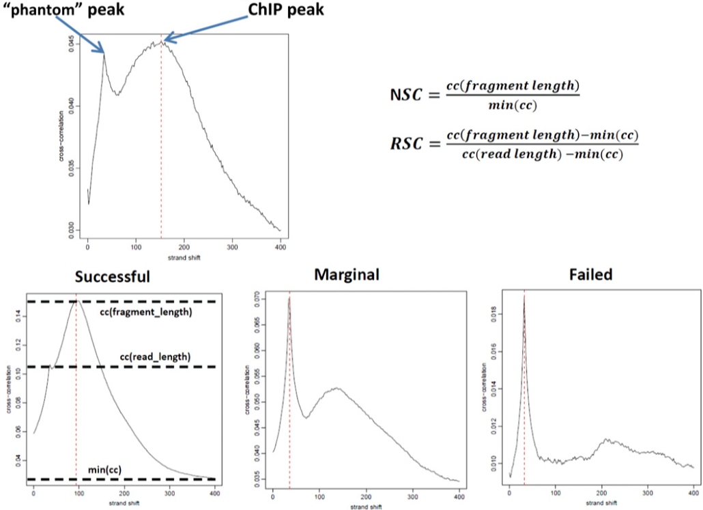
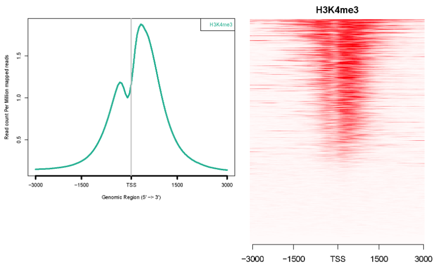

# nf-core/ChIPseq Output

**nf-core/ChIPseq** is a bioinformatics best-practice analysis pipeline used for ChIP-seq (chromatin immunoprecipitation sequencing) data analysis at the [National Genomics Infastructure](https://ngisweden.scilifelab.se/) at [SciLifeLab Stockholm](https://www.scilifelab.se/platforms/ngi/), Sweden.

This document describes the output produced by the pipeline.

## Pipeline overview:
The pipeline is built using [Nextflow](https://www.nextflow.io/)
and processes data using the following steps:

* [FastQC](#fastqc) - read quality control
* [TrimGalore](#trimgalore) - adapter trimming
* [BWA](#bwa) - alignment
* [SAMtools](#samtools) - alignment result processing
* [Bedtools](#bedtools) - bam to bed file conversion
* [Picard](#picard) - duplicate reads removal
* [Phantompeakqualtools](#phantompeakqualtools) - normalized strand cross-correlation (NSC) and relative strand cross-correlation (RSC)
* [deepTools](#deeptools) - fingerprint and correlation plots of reads over genome-wide bins
* [NGSplot](#ngsplot) - distribution of reads around transcription start sites (TSS) and gene bodies
* [MACS](#macs) - peak calling
* [MultiQC](#multiqc) - aggregate report, describing results of the whole pipeline

## FastQC
[FastQC](http://www.bioinformatics.babraham.ac.uk/projects/fastqc/) gives general quality metrics about your reads. It provides information about the quality score distribution across your reads, the per base sequence content (%T/A/G/C). You get information about adapter contamination and other overrepresented sequences.

For further reading and documentation see the [FastQC help](http://www.bioinformatics.babraham.ac.uk/projects/fastqc/Help/).

> **NB:** The FastQC plots displayed in the MultiQC report shows _untrimmed_ reads. They may contain adapter sequence and potentially regions with low quality. To see how your reads look after trimming, look at the FastQC reports in the `trim_galore` directory.

**Output directory: `results/fastqc`**

* `sample_fastqc.html`
  * FastQC report, containing quality metrics for your untrimmed raw fastq files
* `sample_fastqc.zip`
  * zip file containing the FastQC report, tab-delimited data file and plot images

## TrimGalore
[TrimGalore](http://www.bioinformatics.babraham.ac.uk/projects/trim_galore/) is used for removal of adapter contamination and trimming of low quality regions. TrimGalore uses [Cutadapt](https://github.com/marcelm/cutadapt) for adapter trimming and runs FastQC after it finishes.

MultiQC reports the percentage of bases removed by TrimGalore in the _General Statistics_ table, along with a line plot showing where reads were trimmed.

**Output directory: `results/trimgalore`**

Contains FastQ files with quality and adapter trimmed reads for each sample, along with a log file describing the trimming.

* `sample_val_1.fq.gz`, `sample_val_2.fq.gz`
  * Trimmed FastQ data, reads 1 and 2.
* `sample_val_1.fastq.gz_trimming_report.txt`
  * Trimming report (describes which parameters that were used)
* `sample_val_1_fastqc.html`
* `sample_val_1_fastqc.zip`
  * FastQC report for trimmed reads

Single-end data will have slightly different file names and only one FastQ file per sample:
* `sample_trimmed.fq.gz`
  * Trimmed FastQ data
* `sample.fastq.gz_trimming_report.txt`
  * Trimming report (describes which parameters that were used)
* `sample_trimmed_fastqc.html`
* `sample_trimmed_fastqc.zip`
  * FastQC report for trimmed reads

## BWA
[BWA](http://bio-bwa.sourceforge.net/), or Burrows-Wheeler Aligner, is designed for mapping low-divergent sequence reads against reference genomes. The result alignment files are further processed with [SAMtools](http://samtools.sourceforge.net/) and [Bedtools](http://bedtools.readthedocs.io/en/latest/).

**Output directory: `results/bwa`**

* `sample.sorted.bam`
  * The sorted aligned BAM file
* `sample.sorted.bam.bai`
  * The index file for aligned BAM file
* `sample.sorted.bed`
  * The sorted aligned BED file

## Picard
The [MarkDuplicates](https://broadinstitute.github.io/picard/command-line-overview.html#MarkDuplicates) module in the [Picard](https://broadinstitute.github.io/picard/) toolkit differentiates the primary and duplicate reads using an algorithm that ranks reads by the sums of their base-quality scores, which helps to identify duplicates that arise during sample preparation e.g. library construction using PCR.

The Picard section of the MultiQC report shows a bar plot with the numbers and proportions of primary reads, duplicate reads and unmapped reads.

**Output directory: `results/picard`**

* `sample.dedup.sorted.bam`
  * The sorted aligned BAM file after duplicate removal
* `sample.dedup.sorted.bam.bai`
  * The index file for aligned BAM file after duplicate removal
* `sample.dedup.sorted.bed`
  * The sorted aligned BED file after duplicate removal
* `sample.picardDupMetrics.txt`
  * The log report for duplicate removal

## Phantompeakqualtools
[Phantompeakqualtools](https://code.google.com/archive/p/phantompeakqualtools/) plots the strand cross-correlation of aligned reads for each sample. In a strand cross-correlation plot, reads are shifted in the direction of the strand they map to by an increasing number of base pairs and the Pearson correlation between the per-position read count vectors for each strand is calculated. Two cross-correlation peaks are usually observed in a ChIP experiment, one corresponding to the read length ("phantom" peak) and one to the average fragment length of the library. The absolute and relative height of the two peaks are useful determinants of the success of a ChIP-seq experiment. A high-quality IP is characterized by a ChIP peak that is much higher than the "phantom" peak, while often very small or no such peak is seen in failed experiments.

*Source: Landt SG et al, Genome Research (2012)*

Normalized strand coefficient (NSC) is the normalized ratio between the fragment-length cross-correlation peak and the background cross-correlation. NSC values range from a minimum of 1 to larger positive numbers. 1.1 is the critical threshold. Datasets with NSC values much less than 1.1 (< 1.05) tend to have low signal to noise or few peaks (this could be biological eg. a factor that truly binds only a few sites in a particular tissue type OR it could be due to poor quality). ENCODE cutoff: NSC > 1.05.

Relative strand correlation (RSC) is the ratio between the fragment-length peak and the read-length peak. RSC values range from 0 to larger positive values. 1 is the critical threshold. RSC values significantly lower than 1 (< 0.8) tend to have low signal to noise. The low scores can be due to failed and poor quality ChIP, low read sequence quality and hence lots of mismappings, shallow sequencing depth (significantly below saturation) or a combination of these. Like the NSC, datasets with few binding sites (< 200), which is biologically justifiable, also show low RSC scores. ENCODE cutoff: RSC > 0.8.

**Output directory: `results/phantompeakqualtools`**

* `sample.dedup.sorted.pdf`
  * The strand cross-correlation plot of aligned reads after duplicate removal
* `sample.spp.out`
  * Normalized strand cross-correlation (NSC) and relative strand cross-correlation (RSC) results

## deepTools
[deepTools](https://deeptools.github.io/) visualizes the fingerprint of sequence reads distribution, and the pair-wise correlation of samples based on genome-wide reads counts.

In a fingerprint plot, a completely random distribution of reads along the genome (i.e. without enrichments in open chromatin etc.) should generate a straight diagonal line. A very specific and strong regional enrichment will be indicated by a prominent and steep rise of the cumulative sum towards the highest rank. This means that a big chunk of reads from the  sample is located in few bins which corresponds to high, narrow enrichments which are typically seen for transcription factors.

Spearman correlation coefficient in each square is calculated with the read counts in genomic bins between the sample pair at the top and the right. A higher correlation coefficient value indicates higher similarity between the sample pair.

**Output directory: `results/deepTools`**

* `fingerprint.pdf`
  * Fingerprint plot for sequencing reads distribution
* `heatmap_SpearmanCorr.png`
  * Spearman pairwise correlation of samples based on read counts
* `heatmap_PearsonCorr.png`
  * Scatter plot of read counts between sample pairs

## NGSplot
[NGSplot](https://github.com/shenlab-sinai/ngsplot) visualizes the distribution of sequence reads around the transcription start site (TSS), as well as along the gene body plus upstream and downstream flanking regions of the closest annotated genes.

**Output directory: `results/ngsplot`**

* `TSS.avgprof.pdf`
  * Density plot of sequencing reads distribution around TSS
* `TSS.heatmap.pdf`
  * Heatmap of sequencing reads distribution around TSS
* `Genebody.avgprof.pdf`
  * Density plot of sequencing reads distribution along gene bodies
* `Genebody.heatmap.pdf`
  * Heatmap of sequencing reads distribution along gene body

## MACS
[MACS](https://github.com/taoliu/MACS), or Model-based Analysis of ChIP-Seq, is used for capturing the enriched regions of sequence reads. It takes the influence of genome complexity into consideration, and improves the spatial resolution of binding sites through combining the information of both sequencing tag position and orientation.

**Output directory: `results/macs`**

* `assay_peaks.xls`
  * Tabular file which contains information about called peaks. Information include:
    * chromosome name
    * start position of peak
    * end position of peak
    * length of peak region
    * absolute peak summit position
    * pileup height at peak summit, -log10(pvalue) for the peak summit (e.g. pvalue =1e-10, then this value should be 10)
    * fold enrichment for this peak summit against random Poisson distribution with local lambda, -log10(qvalue) at peak summit
* `assay_peaks.narrowPeak`
  * BED6+4 format file which contains the peak locations together with peak summit, pvalue and qvalue.
* `assay_summits.bed`
  * BED format file which contains the peak summits locations for every peaks.
* `assay_peaks.broadPeak`
  * BED6+3 format file which is similar to narrowPeak file, except for missing the column for annotating peak summits.
* `assay_peaks.gappedPeak`
  * BED12+3 format file which contains both the broad region and narrow peaks.
* `assay_model.r`
  * R script with which a PDF image about the model based on your data can be produced.
* `.bdg`
  * bedGraph format files which can be imported to UCSC genome browser or be converted into even smaller bigWig files.

*Refer to https://github.com/taoliu/MACS for the specifications of the output fields.*

## MultiQC
[MultiQC](http://multiqc.info) is a visualisation tool that generates a single HTML report summarising all samples in your project. Most of the pipeline QC results are visualised in the report and further statistics are available in within the report data directory.

**Output directory: `results/MultiQC`**

* `multiqc_report.html`
  * MultiQC report - a standalone HTML file that can be viewed in your web browser
* `multiqc_data/`
  * Directory containing parsed statistics from the different tools used in the pipeline

For more information about how to use MultiQC reports, see http://multiqc.info
